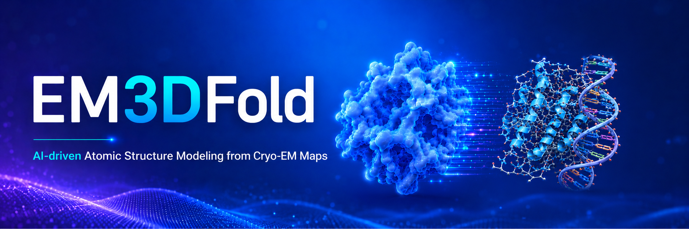
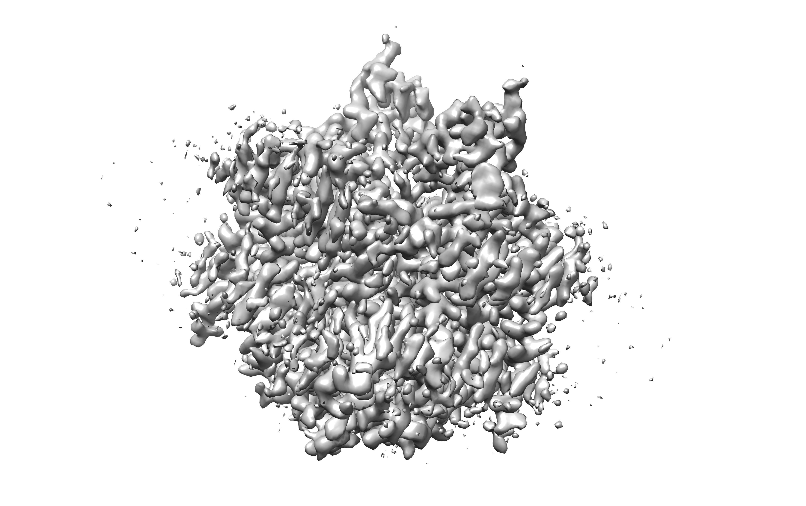
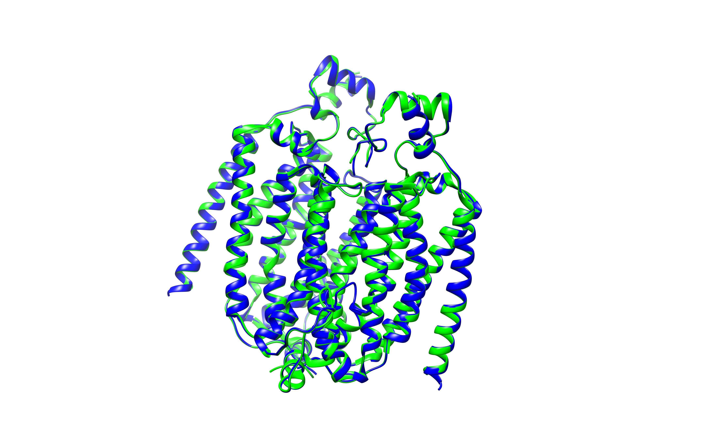
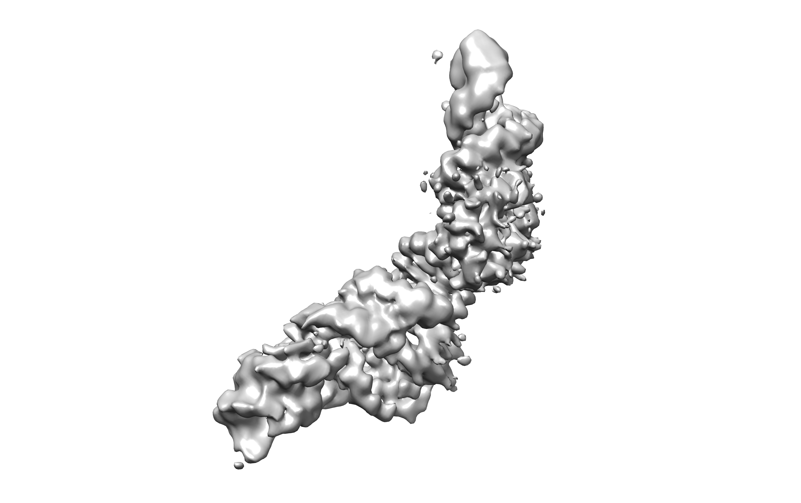
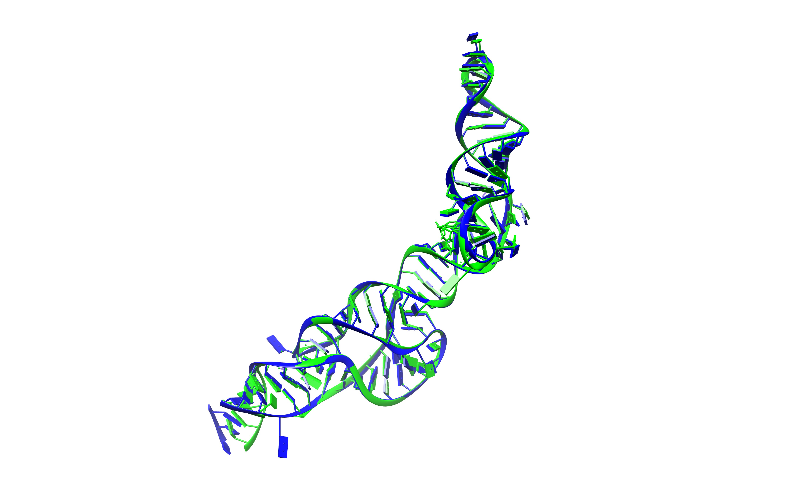
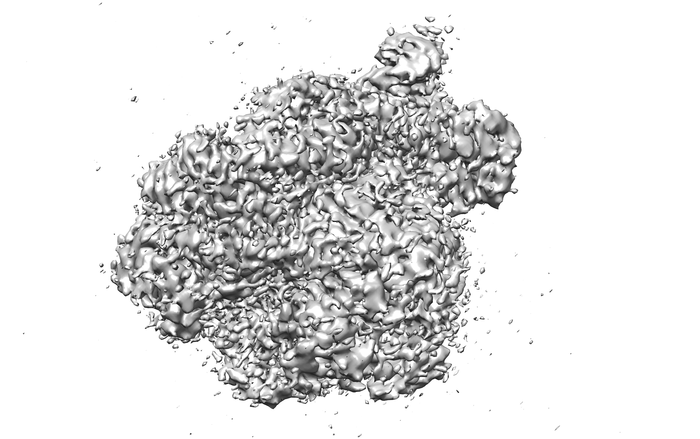
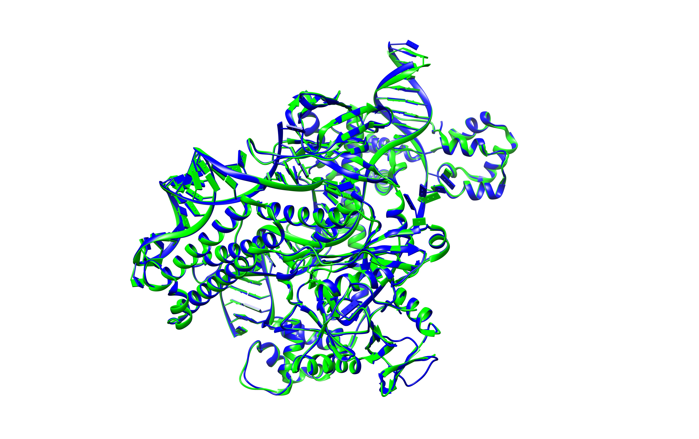
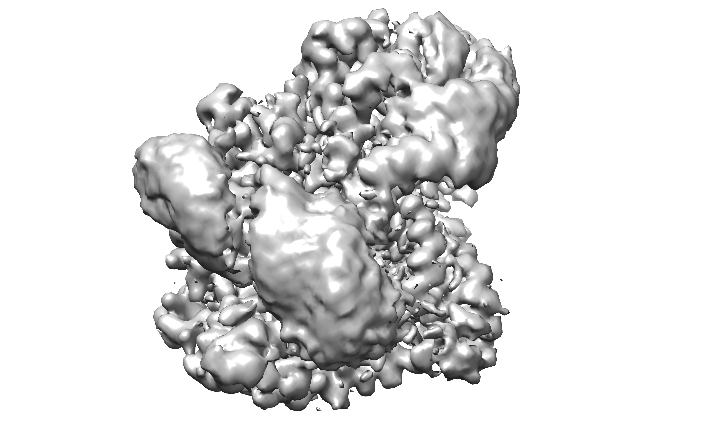
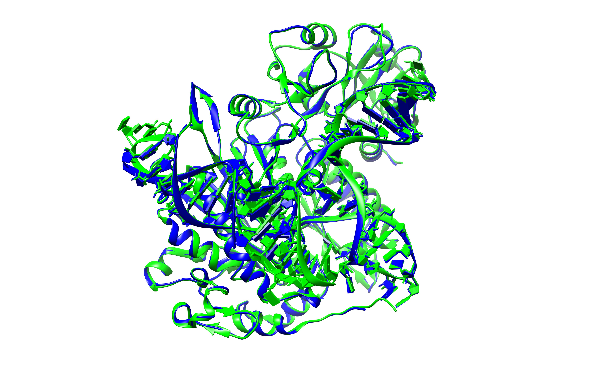

# EM3DFold

<div align="center">
<!--

-->

</div>


## Overview
EM3DFold is a software package for automatic protein, RNA, and DNA structure modeling from cryo-EM density maps.

<!--
<p align="center">
  
</p>
-->

## Requirements
**Platform**: Linux.

> [!NOTE]
> To use EM3DFold on Windows, you may install a Linux system via [Windows WSL](https://learn.microsoft.com/en-us/windows/wsl/install).

**GPU**: A GPU with at least 12 GB VRAM is required.

**CUDA**: CUDA >= 11.8 is required.

**Disk Storage**: EM3DFold pretrained weights and language model weights require at least 6 GB free disk space.

## Installation
#### 1. Install conda

We recommend using conda to manage the environment. If conda is not installed, please install Miniforge, Miniconda or Anaconda first.

[Click here](https://docs.conda.io/en/latest/miniconda.html) to see guidance to install Miniconda.

#### 2. Download EM3DFold

Download EM3DFold via `git` (recommended):
```bash
git clone https://github.com/huang-laboratory/EM3DFold.git
cd EM3DFold
```
If you do not use git, download the source archive via `wget` and extract it manually, e.g. with command:
```bash
wget https://github.com/huang-laboratory/EM3DFold/archive/refs/heads/main.zip
unzip main.zip
cd EM3DFold-main
```

#### 3. Create conda env and install dependencies

We write the tedious installation steps into one script, so installation is one command like:
```bash
# In the EM3DFold directory and have conda
bash scripts/install.sh
```

> [!NOTE]
> If you are familiar with conda/pip/shell or you encounter problems when running the above command, you could run commands in `install.sh` step-by-step.

#### 4. Download pretrained weights

The provided `download.sh` script automatically downloads the pretrained weights of EM3DFold and the required language models into the specified directory:

```bash
# Download all weights and set env var `EM_WEIGHTS_DIR`
# Replace /path/to/save/pretrained/weights/ to the actual path
conda activate em3dfold
bash scripts/download.sh /path/to/save/pretrained/weights/

# After downloading, the conda env needs to be refreshed
conda deactivate
conda activate em3dfold

# Check if `EM_WEIGHTS_DIR` is successfully set
echo $EM_WEIGHTS_DIR
```

> [!NOTE]
> If downloading fails, download the weights manually. And if the script fails to set EM_WEIGHTS_DIR, run it manually:
> ```bash
> # In EM3DFold env
> conda env config vars set EM_WEIGHTS_DIR=/path/to/save/pretrained/weights/ -n em3dfold
>```

## Update to latest version
If you have already installed EM3DFold and want to get the latest version, run the following commands:
```bash
cd /path/to/EM3DFold/
git pull
conda activate em3dfold
pip install .
```

If `env.yml` and pretrained weights changed, we will add more guidance here.

## Usage
Running EM3DFold is straight forward with one command like
```bash
em3dfold build --map/-m MAP.mrc \
    --protein/-p PROTEIN.fa \
    --rna/-r RNA.fa \
    --dna/-d DNA.fa \
    --output OUT \
    --device 0
```

EM3DFold reads env variable `EM_WEIGHTS_DIR` by default to find the pretrained model weights, which should be set during the installation steps above. You can also explicitly set the weights directory every time you running EM3DFold by:
```bash
EM_WEIGHTS_DIR=/path/to/weights em3dfold build --map ...
```

- The cryo-EM density map and output directory are **required**.
- Input FASTA files can each include multiple sequences.
- You can provide only `--protein`, only `--rna`, only `--dna`, or any valid combination of them.
- If you launch >1 modeling job, the output directory **MUST** be different for each run.
- GPU device control:
  - `--device 0` means use `cuda:0`.
  - Multiple GPUs are supported with a comma-separated list such as `--device 0,1,2,3`.
  - Multi-GPU acceleration is currently only used in the `CA/C4' prediction` and `denovo modeling` stages. 
  - More GPUs usually make the run faster, but the speedup is not linear.
- By default, intermediate results (predicted atom probability maps and recycled structures) will be removed. Use `--keep-temp-files` if you want to keep them. 

Typical output directory layout:
```text
OUTPUT_DIR/
├── run.log
├── output.cif
├── output_denovo.cif
├── output_denovo_entropy_scores.cif
└── temp/  # only kept with --keep-temp-files
    ├── format_map.mrc # formated input map
    ├── pred/ # predicted atom maps
    ├── denovo/ # denovo modeling temp files
    ├── ...
```

- `run.log`: detailed running logs.
- `output.cif`: final model.
- `output_denovo.cif`: de novo model.
- `output_denovo_entropy_scores.cif`: de novo model with amino-acid entropy scores.

**Check the command usage any time you forget how to run EM3DFold**
```bash
em3dfold build --help
```

## Examples
<details>
<summary>Protein denovo modeling</summary>
<br>

```bash
em3dfold build --map MAP.mrc \ 
  --protein protein.fa \ 
  --output out_protein \ 
  --device 0
```

Below shows how we download a target protein sequence and map from the PDB/EMDB and run EM3DFold modeling on it:
```bash
# download sequence
wget https://www.rcsb.org/fasta/entry/9UO1 -O 9UO1.fa
# download map
wget https://files.wwpdb.org/pub/emdb/structures/EMD-64369/map/emd_64369.map.gz -O emd_64369.map.gz
gunzip emd_64369.map.gz
```
```bash
# run EM3DFold
em3dfold build --map emd_64369.map --protein 9UO1.fa -o 9UO1
```
<table align="center">
    <tr>
        <td align="center">
            <p>The input map</p>
            
        </td>
        <td align="center">
            <p>The output model (blue) and the PDB model (green)</p>
            
        </td>
    </tr>
</table>

</details>


<details>
<summary>RNA denovo modeling</summary>
<br>

```bash
em3dfold build --map MAP.mrc \ 
  --rna rna.fa \ 
  --output out_rna \ 
  --device 0
```

Below shows how we download a target RNA sequence and map from the PDB/EMDB and run EM3DFold modeling on it:
```bash
# download sequence
wget https://www.rcsb.org/fasta/entry/8T5O -O 8T5O.fa
# download map
wget https://files.wwpdb.org/pub/emdb/structures/EMD-41059/map/emd_41059.map.gz -O emd_41059.map.gz
gunzip emd_41059.map.gz
```
```bash
# run EM3DFold
em3dfold build --map emd_41059.map --rna 8T5O.fa -o 8T5O
```
<table align="center">
    <tr>
        <td align="center">
            <p>The input map</p>
            
        </td>
        <td align="center">
            <p>The output model (blue) and the PDB model (green)</p>
            
        </td>
    </tr>
</table>

</details>


<details>
<summary>Protein-nucleic acid complex denovo modeling</summary>
<br>

```bash
em3dfold build --map MAP.mrc \ 
  --protein protein.fa \ 
  --rna rna.fa \ 
  --dna dna.fa \
  --output out_complex \ 
  --device 0
```

Below shows how we download the target protein, RNA, DNA sequences and map from the PDB/EMDB and run EM3DFold modeling on it:
```bash
# download sequence
wget https://www.rcsb.org/fasta/entry/8Y9N -O 8Y9N.fa
# split sequences into protein, rna and dna parts
: > 8Y9N_prot.fa && : > 8Y9N_rna.fa && : > 8Y9N_dna.fa && awk 'BEGIN{prot="8Y9N_prot.fa";rna="8Y9N_rna.fa";dna="8Y9N_dna.fa"} /^>/{out=($0~/\|crRNA\|/)?rna:(($0~/\|DNA/)? dna:prot)} {if(out!="") print >> out}' 8Y9N.fa
# download map
wget https://files.wwpdb.org/pub/emdb/structures/EMD-39084/map/emd_39084.map.gz -O emd_39084.map.gz
gunzip emd_39084.map.gz
```
```bash
# run EM3DFold
em3dfold build --map emd_39084.map --protein 8Y9N_prot.fa --rna 8Y9N_rna.fa --dna 8Y9N_dna.fa -o 8Y9N
```
<table align="center">
    <tr>
        <td align="center">
            <p>The input map</p>
            
        </td>
        <td align="center">
            <p>The output model (blue) and the PDB model (green)</p>
            
        </td>
    </tr>
</table>

</details>


<details>
<summary>Modeling without sequences</summary>
<br>

```bash
em3dfold build --map MAP.mrc \
  -o out_no_seq \
  --device 0
```
By default, EM3DFold builds all protein and nucleic acid structures. We provide another sub-program `build_no_seq` with more options if you want to build only the protein/nucleic acid parts.
```bash
# build_no_seq provides more options
em3dfold build_no_seq --map MAP.mrc \
  -o out_no_seq \
  --protein \ # build the protein parts
  --rna \ # build the nucleic acid parts
  --dna \ # build the nucleic acid parts
  --device 0
```

Below shows how we download the target map from the EMDB and run EM3DFold sequence-free modeling on it:
```bash
# download map (PDB-9Z2N, EMD-73772)
wget https://files.wwpdb.org/pub/emdb/structures/EMD-73772/map/emd_73772.map.gz -O emd_73772.map.gz
gunzip emd_73772.map.gz
```
```bash
# run EM3DFold with build or build_no_seq
em3dfold build --map emd_73772.map -o 73772
```
<table align="center">
    <tr>
        <td align="center">
            <p>The input map</p>
            
        </td>
        <td align="center">
            <p>The output model (blue) and the PDB model (green)</p>
            
        </td>
    </tr>
</table>

</details>


<details>
<summary>Identify unknown protein/nucleic acids from cryo-EM map</summary>
<br>

First, lanuch a sequence-free job on an input map:
```bash
em3dfold build --map MAP.mrc -o out_no_seq
```
Afterwards, run the `hmm_search` sub-program of em3dfold to search the possible sequences out of sequence databases:
```bash
em3dfold hmm_search \
  --input-dir out_no_seq \ # must be the same output dir of the seq-free modeling job
  --protein-fasta protein_db.fa \ # contains all candidate sequences
  --na-fasta na_db.fa \ # contains all candidate sequences
  --out out_dir
```
The all/best matched sequences for each fragment are saved in `<out_dir>/all_hits.tsv` and `<out_dir>/best_hits.tsv`


Below shows how we search the possible sequences of EMD-73772 against *Homo sapiens* sequence databases:
```bash
# download the sequence database of homo sapiens
wget http://huanglab.phys.hust.edu.cn/EM3DFold/examples/73772/homo_sapiens_protein.fa -O homo_sapiens_protein.fa
wget http://huanglab.phys.hust.edu.cn/EM3DFold/examples/73772/homo_sapiens_rna.fa -O homo_sapiens_rna.fa
# run hmm_search on previous sequence-free modeling output directory, e.g. 73772
em3dfold hmm_search --input-dir 73772 --protein-fasta homo_sapiens_protein.fa --na-fasta homo_sapiens_rna.fa -o 73772/hmm_output --max-target-len 10000 # ignore too long sequences
```

The original sources for the prepared `homo_sapiens_protein.fa` and `homo_sapiens_rna.fa`:
- nucleic acid from ncbi
  - https://ftp.ncbi.nlm.nih.gov/refseq/H_sapiens/annotation/GRCh38_latest/refseq_identifiers/GRCh38_latest_rna.fna.gz
- protein from uniprotkb
  - https://www.uniprot.org/uniprotkb?query=Homo+sapiens&facets=reviewed%3Atrue


We provide our searching result on this target, check the result:
```bash
wget -qO- 'http://huanglab.phys.hust.edu.cn/EM3DFold/examples/73772/best_hits.tsv'
```
As shown, we identified 5 candidate sequences: `NR_024457.2`, `NM_001378633.1`, `NR_027232.1`, `XM_011522507.4`, `XR_007086624.1` for nucleic acids, in which `XM_011522507.4` is the correct match of chain B of PDB-9Z2N.

For proteins, we identified 2 protein sequences as candidates: `Q08J23` and `P14618`, in which `Q08J23` is the correct match of chain A of PDB-9Z2N.


</details>


## Trouble shooting
- **No module named "xxx"**: package `xxx` is missing in your current environment. Install it with `pip install xxx` or `conda install xxx`.

- **em3dfold: command not found**: you are probably not in the correct environment, activate EM3DFold environment and run again.

- **CUDA / PyTorch related errors**: check whether your installed `torch` matches the local CUDA runtime and GPU driver.

- **GLIBCXX / CXXABI errors**: this usually means the runtime `libstdc++` in your current environment is older than the one required. A common fix is to add the EM3DFold conda environment `lib/` directory to `$LD_LIBRARY_PATH`:
  ```bash
  export LD_LIBRARY_PATH=/path/to/conda/env/em3dfold/lib:$LD_LIBRARY_PATH
  ```
  When the `em3dfold` environment is activated, you can find `/path/to/conda/env/em3dfold/` with:
  ```bash
  echo $CONDA_PREFIX
  ```

## Citation
If you find EM3DFold useful, please cite the following papers.

```bibtex
@article{EM3DFold,
  title={Highly accurate protein-nucleic acid modeling from cryo-EM maps with EM3DFold},
  author={Tao Li, Sheng-You Huang},
  journal={In submission},
  year={2026}
}

@article{EMProt,
  title={EMProt improves structure determination from cryo-EM maps},
  author={Tao Li, Ji Chen, Hao Li, Hong Cao & Sheng-You Huang},
  journal={Nature Structural & Molecular Biology},
  year={2025}
}

@article{EM2NA,
  #title={Automated detection and de novo structure modeling of nucleic acids from cryo-EM maps},
  author={Tao Li, Hong Cao, Jiahua He & Sheng-You Huang},
  journal={Nature Communications},
  year={2024}
}
```
