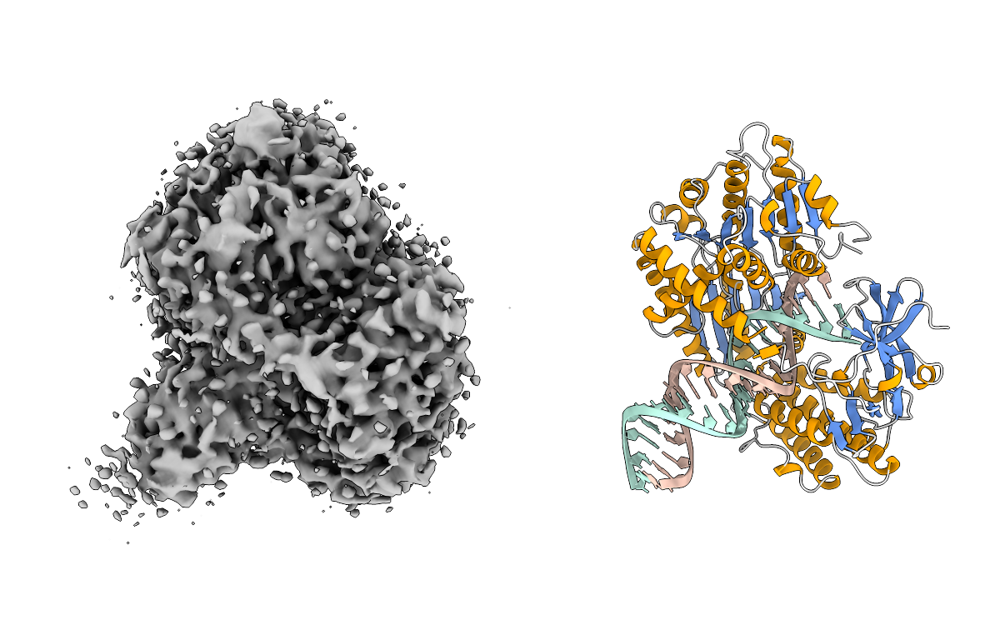

# EM3DFold

## Overview
EM3DFold is a software package for automatic protein, RNA, and DNA structure modeling from cryo-EM density maps.

<p align="center">
  
</p>

## Requirements
**Platform**: Linux.

> [!NOTE]
> To use EM3DFold on Windows, you may install a Linux system via [Windows WSL](https://learn.microsoft.com/en-us/windows/wsl/install).

**GPU**: A GPU with at least 12 GB VRAM is required.

**CUDA**: CUDA >= 11.8 is required.

**Disk Storage**: EM3DFold pretrained weights and language model weights require at least 6 GB free disk space.

## Installation
#### 1. Install conda

We recommend using conda to manage the environment. If conda is not installed, please install Miniforge, Miniconda or Anaconda first.

[Click here](https://docs.conda.io/en/latest/miniconda.html) to see guidance to install Miniconda.

#### 2. Download EM3DFold

Download EM3DFold via `git` (recommended):
```bash
git clone https://github.com/huang-laboratory/EM3DFold.git
cd EM3DFold
```
If you do not use git, download the source archive via `wget` and extract it manually, e.g. with command:
```bash
wget https://github.com/huang-laboratory/EM3DFold/archive/refs/heads/main.zip
unzip main.zip
cd EM3DFold-main
```

#### 3. Create conda env and install dependencies

We write the tedious installation steps into one script, so installation is one command like:
```bash
# In the EM3DFold directory and have conda
bash scripts/install.sh
```

> [!NOTE]
> If you are familiar with conda/pip/shell or you encounter problems when running the above command, you could run commands in `install.sh` step-by-step.

#### 4. Download pretrained weights

The provided `download.sh` script automatically downloads the pretrained weights of EM3DFold and the required language models into the specified directory:

```bash
# Download all weights and set env var `EM_WEIGHTS_DIR`
# Replace /path/to/save/pretrained/weights/ to the actual path
bash scripts/download.sh /path/to/save/pretrained/weights/

# After downloading, the conda env needs to be refreshed
conda deactivate
conda activate em3dfold

# Check if `EM_WEIGHTS_DIR` is successfully set
echo $EM_WEIGHTS_DIR
```

> [!NOTE]
> If downloading fails, download the weights manually. And if the script fails to set EM_WEIGHTS_DIR, run it manually:
> ```bash
> # In EM3DFold env
> conda env config vars set EM_WEIGHTS_DIR=/path/to/save/pretrained/weights/ -n em3dfold
>```

## Update to latest version
If you have already installed EM3DFold and want to get the latest version, run the following commands:
```bash
cd /path/to/EM3DFold/
git pull
conda activate em3dfold
pip install .
```

If `env.yml` and pretrained weights changed, we will add more guidance here.

## Usage
Running EM3DFold is straight forward with one command like
```bash
em3dfold build --map/-m MAP.mrc \
    --protein/-p PROTEIN.fa \
    --rna/-r RNA.fa \
    --dna/-d DNA.fa \
    --output OUT \
    --device 0
```

To explicitly set the weights directory:
```bash
EM_WEIGHTS_DIR=/path/to/weights em3dfold build --map ...
```

- The cryo-EM density map and output directory are **required**.
- Input FASTA files can each include multiple sequences.
- You can provide only `--protein`, only `--rna`, only `--dna`, or any valid combination of them.
- If you launch >1 modeling job, the output directory **MUST** be different for each run.
- GPU device control:
  - `--device 0` means use `cuda:0`.
  - Multiple GPUs are supported with a comma-separated list such as `--device 0,1,2,3`.
  - Multi-GPU acceleration is currently only used in the `CA/C4' prediction` and `denovo modeling` stages. 
  - More GPUs usually make the run faster, but the speedup is not linear.
- By default, intermediate results (predicted maps recycled structures) will be removed. Use `--keep-temp-files` if you want to keep them. 

Typical output directory layout:
```text
OUTPUT_DIR/
├── run.log
├── output.cif
├── output_denovo.cif
├── output_denovo_entropy_scores.cif
└── temp/  # only kept with --keep-temp-files
    ├── format_map.mrc # formated input map
    ├── pred/ # predicted atom maps
    ├── denovo/ # denovo modeling temp files
    ├── ...
```

- `run.log`: detailed running logs.
- `output.cif`: final model.
- `output_denovo.cif`: de novo model.
- `output_denovo_entropy_scores.cif`: de novo model with amino-acid entropy scores.

**Check the command usage any time you forget how to run EM3DFold**
```bash
em3dfold build --help
```

## Examples
#### 1. Protein denovo modeling
```bash
em3dfold build --map MAP.mrc \ 
  --protein protein.fa \ 
  --output out_protein \ 
  --device 0
```

#### 2. RNA denovo modeling
```bash
em3dfold build --map MAP.mrc \ 
  --rna rna.fa \ 
  --output out_rna \ 
  --device 0
```

#### 3. Protein-RNA complex denovo modeling
```bash
em3dfold build --map MAP.mrc \ 
  --protein protein.fa \ 
  --rna rna.fa \ 
  --output out_complex \ 
  --device 0
```


## Trouble shooting
- **No module named "xxx"**: package `xxx` is missing in your current environment. Install it with `pip install xxx` or `conda install xxx`.

- **em3dfold: command not found**: you are probably not in the correct environment, activate EM3DFold environment and run again.

- **CUDA / PyTorch related errors**: check whether your installed `torch` matches the local CUDA runtime and GPU driver.

- **GLIBCXX / CXXABI errors**: this usually means the runtime `libstdc++` in your current environment is older than the one required. A common fix is to add the EM3DFold conda environment `lib/` directory to `$LD_LIBRARY_PATH`:
  ```bash
  export LD_LIBRARY_PATH=/path/to/conda/env/em3dfold/lib:$LD_LIBRARY_PATH
  ```
  When the `em3dfold` environment is activated, you can find `/path/to/conda/env/em3dfold/` with:
  ```bash
  echo $CONDA_PREFIX
  ```

## Citation
If you find EM3DFold useful, please cite the following papers.

```bibtex
@article{EM3DFold,
  title={Highly accurate protein-nucleic acid modeling from cryo-EM maps with EM3DFold},
  author={Tao Li, Sheng-You Huang},
  journal={In submission},
  year={2026}
}

@article{EMProt,
  title={EMProt improves structure determination from cryo-EM maps},
  author={Tao Li, Ji Chen, Hao Li, Hong Cao & Sheng-You Huang},
  journal={Nature Structural & Molecular Biology},
  year={2025}
}

@article{EM2NA,
  #title={Automated detection and de novo structure modeling of nucleic acids from cryo-EM maps},
  author={Tao Li, Hong Cao, Jiahua He & Sheng-You Huang},
  journal={Nature Communications},
  year={2024}
}
```
